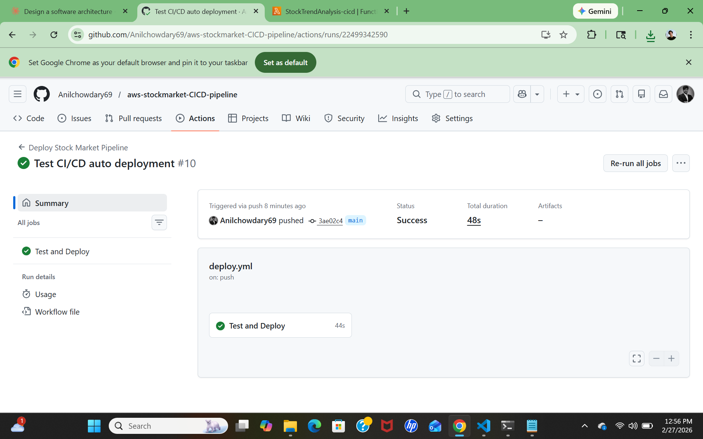
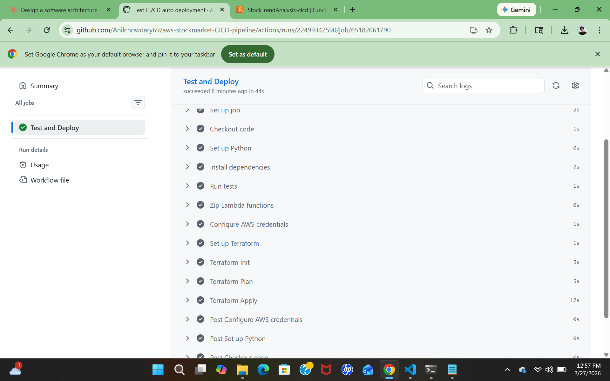
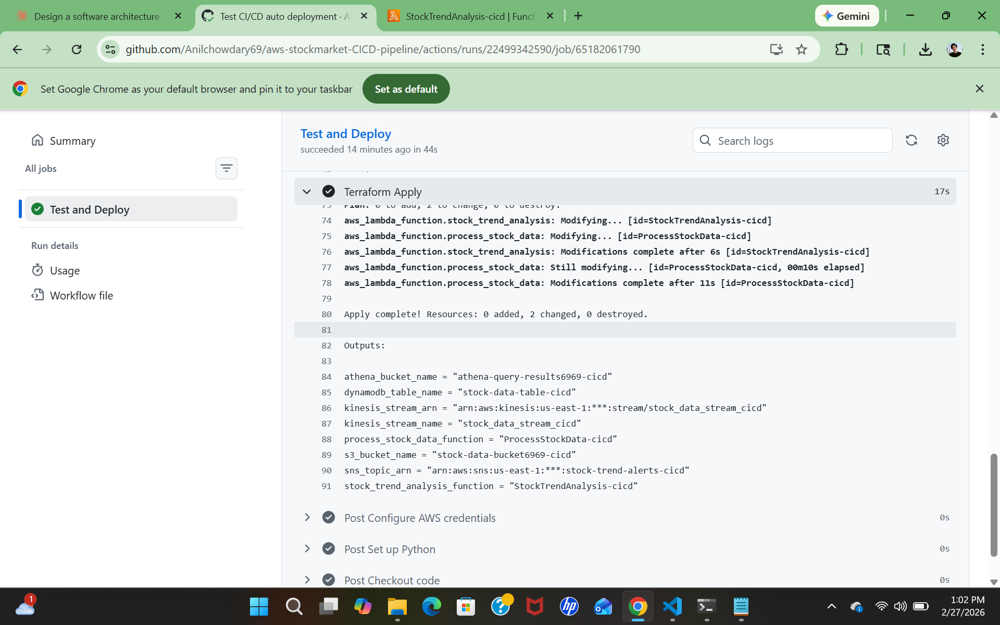

# Automated CI/CD Pipeline — AWS Stock Market Analytics

A fully automated CI/CD pipeline built with GitHub Actions and Terraform that tests, packages, and deploys AWS Lambda functions and infrastructure on every push to main — with zero manual steps.

---

## What This Project Does

Every time code is pushed to the main branch this pipeline automatically runs Python unit tests, packages Lambda functions into zip files, and deploys the entire AWS infrastructure using Terraform. If any test fails the deployment stops — nothing broken ever reaches AWS.

The entire pipeline runs on GitHub's servers with no infrastructure to manage.

---

## How It Works

```
Developer pushes code to main branch
        |
        v
GitHub Actions triggers automatically
        |
        |---> CI STAGE
        |     Install Python and dependencies
        |     Run 5 unit tests on Lambda code
        |     If any test fails — pipeline stops here
        |
        |---> CD STAGE (only runs if all tests pass)
              Zip Lambda functions automatically
              Configure AWS credentials from GitHub Secrets
              Terraform Init — download AWS provider
              Terraform Plan — preview changes
              Terraform Apply — deploy to AWS
                    |
                    v
              Infrastructure live on AWS
```

---

## Pipeline Screenshots

### Successful Pipeline Run


### All Tests Passing


### Terraform Apply Output


---

## Pipeline Stages

### CI Stage — Test Before Deploying

Five automated tests run on every push before anything is deployed:

| Test | What It Checks |
|---|---|
| test_lambda_import | Lambda function file can be imported without errors |
| test_stock_trend_import | Trend analysis file can be imported without errors |
| test_kinesis_event_structure | Kinesis event has correct structure Lambda expects |
| test_price_change_calculation | Price change math produces correct results |
| test_anomaly_detection | Anomaly detection correctly flags changes above 5% |

If any test fails the pipeline stops and nothing gets deployed. This prevents broken code from reaching AWS.

### CD Stage — Automated Deployment

If all tests pass the pipeline automatically packages and deploys:

1. Zips both Lambda function files fresh on every run
2. Authenticates with AWS using encrypted GitHub Secrets
3. Runs terraform init to download the AWS provider
4. Runs terraform plan to preview infrastructure changes
5. Runs terraform apply to deploy all changes to AWS

---

## Infrastructure Deployed

The pipeline deploys a complete stock market analytics pipeline on every push:

| Resource | Name |
|---|---|
| Kinesis Stream | stock-market-stream-cicd |
| Lambda — Ingestion | ProcessStockData-cicd |
| Lambda — Trend Analysis | StockTrendAnalysis-cicd |
| DynamoDB Table | stock-data-table-cicd |
| S3 — Raw Data | stock-data-bucket-cicd-33454 |
| S3 — Athena Results | athena-results-cicd-33454 |
| SNS Topic | stock-trend-alerts-cicd |
| Glue Database | stock-data-db-cicd |
| Glue Table | stock-glue-table-cicd |
| IAM Roles | stock-data-manage-role-cicd, stock-trend-role-cicd |

---

## Terraform Remote State

Terraform state is stored in an S3 backend so the pipeline always knows what infrastructure exists in AWS:

```
s3://stock-market-terraform-state-33454/cicd-pipeline/terraform.tfstate
```

This solves a critical problem — without remote state every pipeline run starts blind and tries to recreate resources that already exist. With S3 remote state Terraform reads the current state before every run and only makes necessary changes.

---

## Security — GitHub Secrets

AWS credentials are never hardcoded in the pipeline. They are stored as encrypted GitHub Secrets and injected at runtime:

| Secret | Purpose |
|---|---|
| AWS_ACCESS_KEY_ID | IAM user access key for AWS authentication |
| AWS_SECRET_ACCESS_KEY | IAM user secret key for AWS authentication |

GitHub Secrets are encrypted at rest and never visible in logs or code. Anyone who clones this repo cannot access AWS without these secrets.

---

## Project Structure

```
aws-cicd-pipeline/
├── .github/
│   └── workflows/
│       └── deploy.yml          # CI/CD pipeline definition
├── lambda/
│   ├── lambda_function.py      # ProcessStockData — Kinesis to DynamoDB and S3
│   └── stock_trend_alert.py    # StockTrendAnalysis — SMA crossover detection
├── terraform/
│   ├── main.tf                 # All AWS resources
│   ├── variables.tf            # Configurable variables
│   ├── outputs.tf              # Post-deployment outputs
│   └── providers.tf            # AWS provider and S3 backend config
├── tests/
│   └── test_lambda.py          # Unit tests that run before every deployment
└── README.md
```

---

## How to Use

**Prerequisites:**
- AWS account with IAM user configured
- GitHub repo with AWS credentials added as Secrets
- Terraform v1.14.5+
- Python 3.13+

**To trigger the pipeline:**
```bash
git add .
git commit -m "your change"
git push
```

That's it. GitHub Actions handles everything else automatically.

**To trigger manually:**
Go to GitHub → Actions tab → Deploy Stock Market Pipeline → Run workflow button.

**To monitor the pipeline:**
Go to GitHub → Actions tab → click the latest run → click each step to see logs.

---

## Challenges and Lessons Learned

**Terraform has no state between pipeline runs by default:** GitHub Actions runs on a fresh server every time with no memory of previous runs. Without remote state Terraform tried to recreate resources that already existed from previous runs causing conflicts. Fixed by configuring an S3 backend to store state persistently between runs.

**Import tests fail without environment variables:** Lambda files initialize boto3 clients at import time which requires AWS region and environment variables. Running import tests without these caused NoRegionError failures. Fixed by setting mock environment variables in the test setup before importing.

**Resource naming conflicts between projects:** Running two Terraform projects against the same AWS account with overlapping resource names causes conflicts. Fixed by using consistent `-cicd` suffix on all resource names to keep Project 1 and Project 2 resources completely separate.

**Lambda zip files must contain the Python file at root level:** If you zip the folder instead of the file itself Lambda cannot find the handler and throws Runtime.ImportModuleError. The CI/CD pipeline always zips correctly by navigating into the lambda folder first before zipping.

---

## Why GitHub Actions Over Jenkins

| GitHub Actions | Jenkins |
|---|---|
| Runs on GitHub's servers — no infrastructure needed | Requires a dedicated server to maintain |
| Free for public repos | Costs money to run 24/7 |
| Built into GitHub — same place as the code | Separate tool requiring integration |
| YAML-based — simple and readable | Groovy-based — steeper learning curve |
| Industry standard for modern teams | Older tool being replaced in many companies |

---

## Author

Built as part of a cloud engineering portfolio to demonstrate CI/CD automation, Infrastructure as Code, automated testing, and secure credential management practices.
